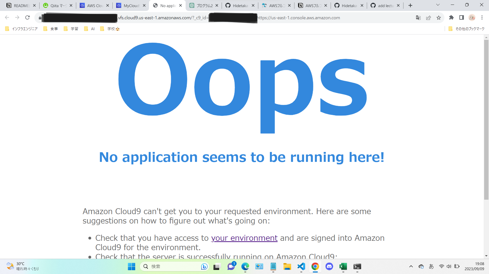

# 課題への回答
## ブラウザ接続成功


## APサーバー

- 名前：puma
- バージョン：5.6.5


APサーバーを終了させた状態でブラウザ接続すると以下の画像のように接続できないことを伝えるメッセージが表示される





## DBサーバー

- 名前：MySQL
- バージョン：8.0.34


DBサーバーを終了させた状態でブラウザ接続すると以下の画像のように接続できないことを伝えるエラー文が表示される


## Rails の構成管理ツールの名前
- Bundler

# 今回の課題から学んだこと
## AWS Cloud9を使ってアプリケーションをデプロイし、ブラウザ接続する手順
1. Cloud9のターミナルでGitHubのリポジトリをクローンするために```git clone [リポジトリのURL]```を実行する。
2. MySQLをインストールする。MySQLの起動が成功したらパスワードを変更する。手順 → [MySQLのインストール](https://github.com/MasatoshiMizumoto/raisetech_documents/blob/main/aws/docs/install_mysql_on_cloud9_amazon_linux_2.md
)

3. yarnをインストールするために```npm install -g yarn```を実行する。yarnがインストールされたら依存関係をインストールするコマンド```yarn install```を実行する。
4. Bundlerをインストールするコマンド```gem install bundler```を実行する。
5. ```cd リポジトリ名```でクローンしたリポジトリのディレクトリに移動したら```bundle install```を実行する。
6. アプリケーションに必要なファイルの設定を行ったら```rails s```でアプリケーションを起動する。
7. Cloud9の「Run」の横にある「Preview」→「Preview Running Application」をクリック。Cloud9の右下にある「Browser」をクリックする。

## Cloud9上で目的のディレクトリに移動するためのコマンド
```pwd```　現在地を把握できる

```ls```　目的のディレクトリに行くためのルートを一覧表示

```cd```　例えば「config」という場所に移動したい場合はcd configと実行する

```cd ..```　現在のディレクトリから一つ前のディレクトリ(親ディレクトリ)に移動できる

## Cloud9で使用しているサーバーの名前を確認する方法
「Gemfile」というファイルの中に使用しているAPサーバーやDBサーバーの名前が書かれている。

## バージョンを調べるコマンド
バージョンを調べるためのコマンドは```[プログラミング言語やサーバー名] --version```のように指定する。例えば、```puma --version```や```ruby --version```といった感じ。

## Cloud9でMySQLサーバーを起動・停止させるコマンド
起動　```sudo systemctl start mysqld```

停止　```sudo systemctl stop mysqld```
